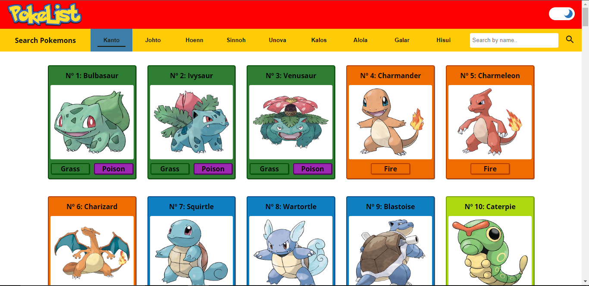
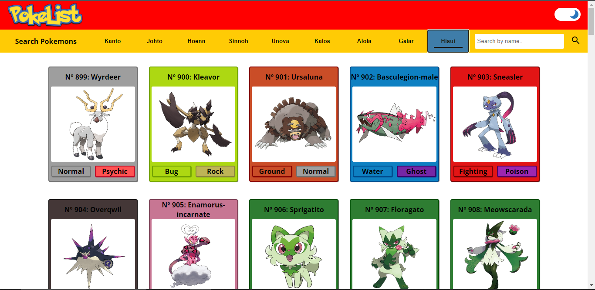
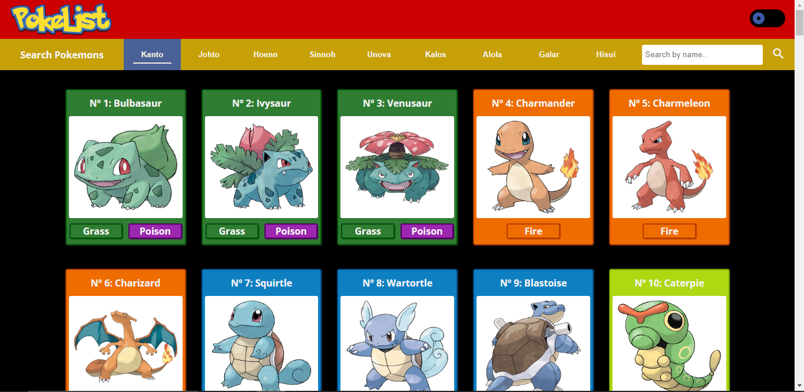
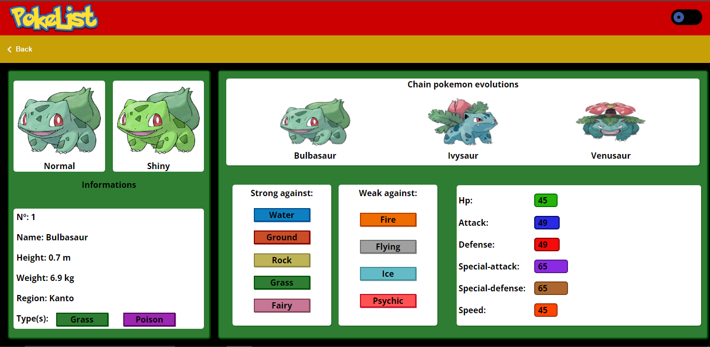
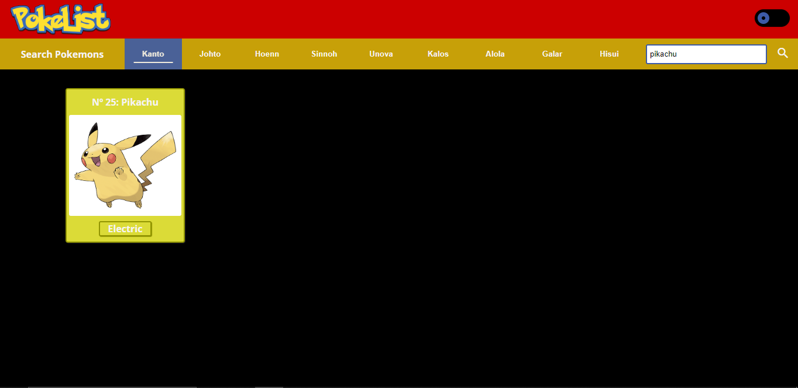
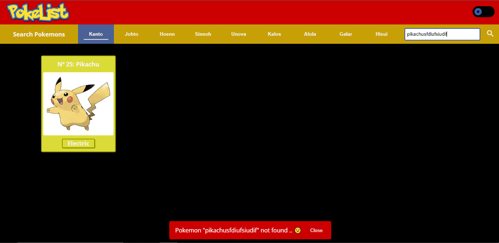

# PokeList

### Web application to consume data from Pokeapi.co  using Angular

## Front-end setup
To install the dependencies, go to the folder PokeList and run: ``` npm i ```

## Usage
This web application retrieved data of all Pokemon of all regions discovered at the moment. The pokeList separate Pokemon of each region and lists them in ascendant order.

## Application Images
By default, when the application is on, the first region (Kanto) is selected, so all of Kanto's Pokemon are listed showing brief information like name, pokedex number, and type.

Observation: Each card that contains a Pokemon, has the color of his primary type.



Case the user selects another region, the Pokemons are listed the same way (ascendant), in the image below "Hisui region" is selected.



The application has a theme switch button on left-top, by default, the light theme is selected, but when the button is clicked, the dark theme is applied as seen in the image below.



<span> Observation: All other images on this readme file contain the application using the dark theme.</span>

<span>In case the user desires more information about a specific Pokemon, just needs to click on it, in the example below simulates a click in Pokemon 1º of pokedex called Bulbasaur.</span>



There are containers that have the Pokemon information like; Pokedex number, Name, Height, Weight, Region, strong and weak type according to Pokemon's type, status information and evolution chain. It is possible to click on any Pokemon in chain evolution (redirect to) to see his specific information page. 

<span>
The application allows the user to search for a Pokemon by name in an input field on the right of the last region (Hisui). The image below shows a search for "Pikachu".
</span>



<span> If Pokemon does not exist, a snackbar  on the bottom center saying that Pokemon does not exist. </span>




